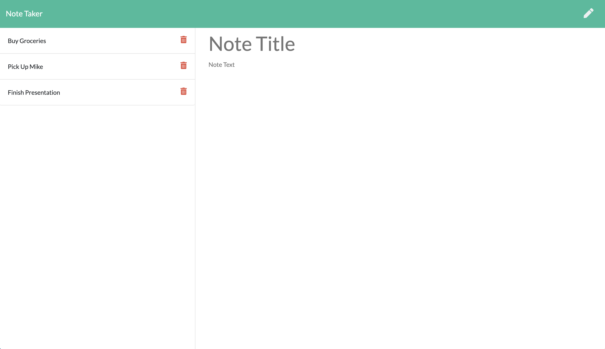

# My Notes


An express.js application to write and store personal notes.

## Description

An express.js application that allows the user to create and delete personal notes. Notes are written to a file, stored in an object, and deleted when the user deems the note no longer useful.

## Table of Contents

* [Reference](#reference)
* [Details](#details)
* [Installation](#installation)
* [Usage](#usage)
* [License](#license)
* [Contributing](#contributing)
* [Questions](#questions)
  
## Reference

  Sample of homepage.
 

  Sample of note screen.
  


## Details
  * Click the link which will navigate you to the homepage. 
  * Click "Get Started" to navigate to the note page.
  * On this page you can...
        * Click on previous notes on the lefthand side to display them in the body of the page. 
        * Click on the pencil in the top right hand corner to write a new note.
        * Write a new note and click the save icon in the top right hand corner to save a new note.
        * Click on the trash can icon next to saved notes to delete them from your list.

## Installation

To install all necessary materials for this project, run the following command:

```
npm install
```

## Usage

This application uses the express and uuid packages. Be sure to install these locally before proceeding.

## License

This application is protected under the MIT license.

For more information, visit this link: [MIT Info](https://opensource.org/licenses/MIT)

## Contributing
Design and note inputs may be changed to the contributors needs and taste.

## Questions

If you have any questions, please reach out.
* GitHub: [AHFotis](https://github.com/AHFotis)
* Email: annahickey2@gmail.com

